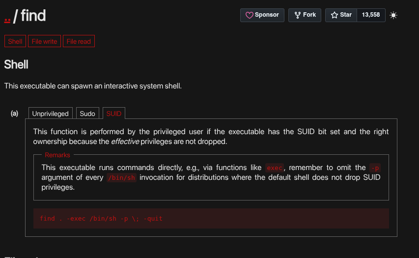
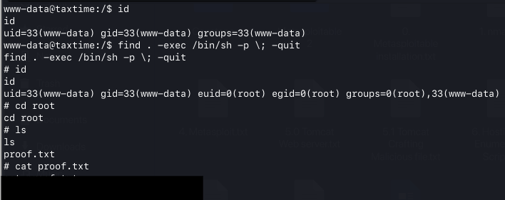

# Privilege Escalation 

After identifying the SUID-enabled `find` binary during enumeration, I investigated whether it could be used to obtain elevated privileges.

I referenced GTFOBins to identify a known privilege-escalation technique for SUID-enabled `find`. The technique uses the following command to spawn a shell while preserving the elevated privileges:

```bash
find . -exec /bin/sh -p \; -quit
```

### SUID `find` Technique from GTFOBins


I executed the command on the target machine, which successfully provided a shell with `root` privileges.

After obtaining the root shell, I navigated to the `/root` directory and retrieved the `proof.txt` flag.

### Obtaining a Root Shell & Retrieving the Flag

