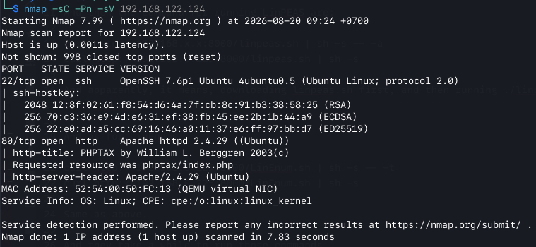

# Reconnaissance

## Initial Enumeration

I started the assessment by running an Nmap scan against the target to identify open ports, services, and their versions.

```bash
nmap -sC -Pn -sV 192.168.122.124
```

The options used in the scan were:

| Option | Purpose |
|---|---|
| -sC | Runs Nmap's default scripts to gather additional information about the target. |
| -Pn | Treats the target as being online without first sending ping requests. |
| -sV | Detects the services and their versions running on the open ports. |

## Services Discovered

The scan identified two open TCP ports:

| Port | State | Service | Version |
|------|-------|---------|---------|
| `22/tcp` | Open | SSH | OpenSSH 7.6p1 Ubuntu 4ubuntu0.5 |
| `80/tcp` | Open | HTTP | Apache httpd 2.4.29 (Ubuntu) |

The HTTP service was identified as hosting the phpTax web application. The requested resource was:

```text
phptax/index.php
```
### Nmap Scan Results



## Service Discussion

I investigated the two services identified during the initial Nmap scan to determine whether either one provided a possible way to gain access to the target.

### SSH

SSH (Secure Shell) is a protocol used to securely access and manage a remote system. The target was running OpenSSH 7.6p1 on Ubuntu.

I did not focus my further investigation on SSH because there was no indication at this stage that it was the likely entry point into the system.

### HTTP / Apache

HTTP is used to serve web content, and the target was running Apache httpd 2.4.29 on Ubuntu.

I focused my initial vulnerability research on Apache because I expected the web server to provide a possible way to gain access to the target. I used SearchSploit to search for known vulnerabilities and exploits related to the Apache version identified during the Nmap scan.

The search returned several possible exploits. I investigated the available options and attempted to use them, but I was not able to gain access to the target through Apache.

I then continued investigating the HTTP service and looked more closely at the phpTax application running on it.

### phpTax

I used SearchSploit to search for known vulnerabilities affecting phpTax:

```bash
searchsploit phptax
```

The search returned three exploit entries targeting phpTax 0.8.

I researched the available exploits and tested two of them first, but neither was successful against the target.

I then investigated the remaining exploit. This exploit, Exploit-DB 21833, was a Ruby-based Metasploit exploit targeting the `pfilez` functionality.

The phpTax vulnerability is associated with CVE-2012-10037, a critical remote code execution vulnerability. This vulnerability provided the attack path that was eventually used to obtain initial access.
